LAB 100
============================

Container Cloud Service Hands-on Guide
======================================

*OCCS 프로비저닝*
=================

Introduction 
-------------

이 튜토리얼에서는 Oracle Container Cloud Service의 서비스 콘솔을 사용하여 새로운
서비스 인스턴스를 생성하는 방법을 설명합니다.

### Objectives

-   OCCS 서비스 콘솔 액세스

-   새로운 OCCS 서비스 인스턴스 만들기

-   서비스 콘솔이 실행 중인지 확인하기 위해 컨테이너 콘솔 표시

### Required Artifacts 

Oracle Container Cloud Service를 사용하기 전에 다음을 수행하십시오.

귀사 또는 귀사의 다른 누군가가 Oracle Container Cloud Service 등록을 주문하고
활성화해야합니다.

자세한 내용은 Oracle 도움말 센터에서 Oracle Container Cloud Service 사용을
참조하십시오.

.

### OutLine

[Introduction 2](#introduction)

[Objectives 2](#objectives)

[Required Artifacts 2](#required-artifacts)

[OutLine 2](#outline)

[Access the OCCS Service Console 2](#access-the-occs-service-console)

[Create a New OCCS Service Instance 7](#create-a-new-occs-service-instance)

[Display the Container Console to Verify the Service Instance is Running
13](#display-the-container-console-to-verify-the-service-instance-is-running)

Access the OCCS Service Console
-------------------------------

1.  브라우저에서 다음 URL로 이동하십시오 : <https://cloud.oracle.com>

2.  브라우저의 오른쪽 상단 모서리에서 로그인을 클릭하십시오.

3.  드롭다운 목록을 클릭하고 데이터센터를 선택한 다음 “My services”를
    클릭하세요.

4.  **identity domain**을 입력하고 **Go**클릭

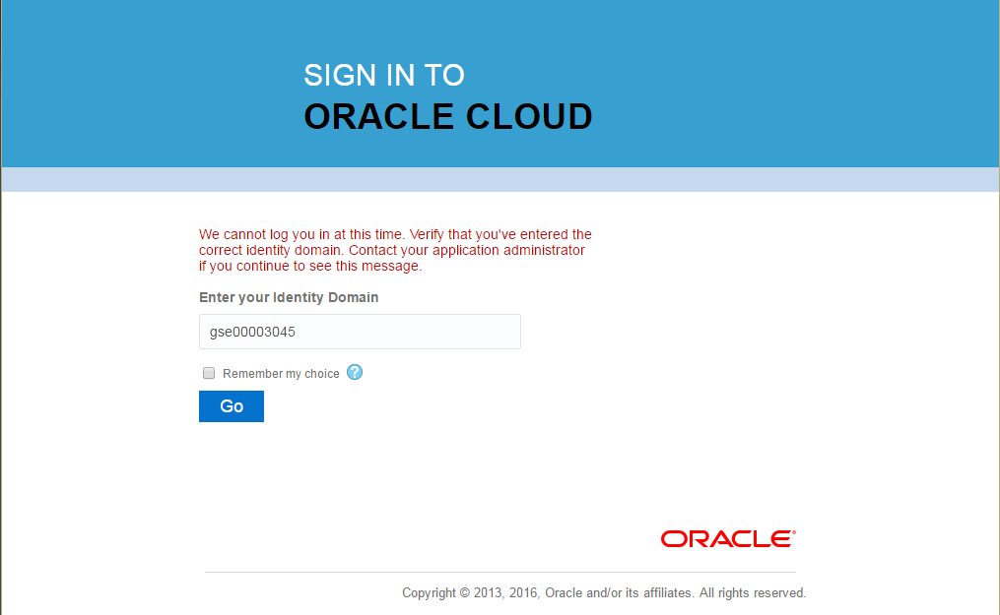

5.  사용자 이름과 비밀번호를 입력하고 **Sign in** 클릭

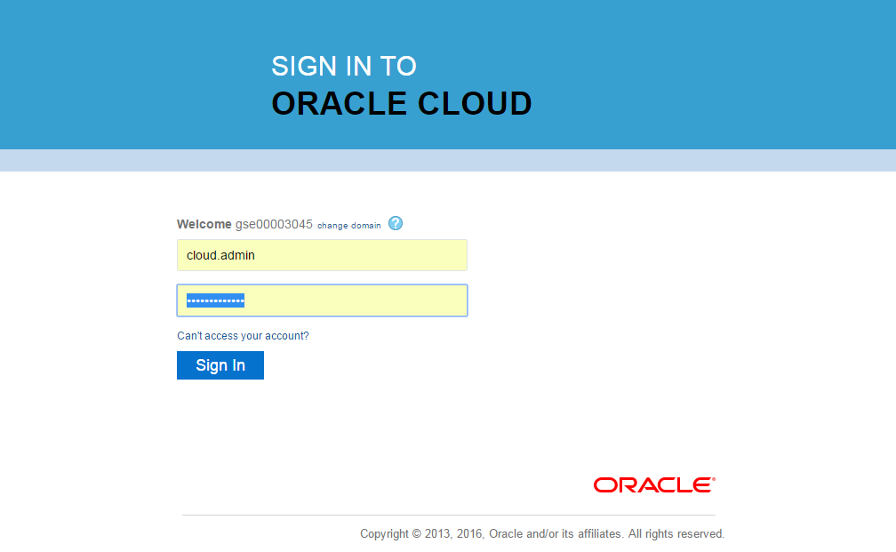

6.  컨테이너 클라우드 서비스의 햄버거 메뉴 -\> **Open Service Console** 클릭

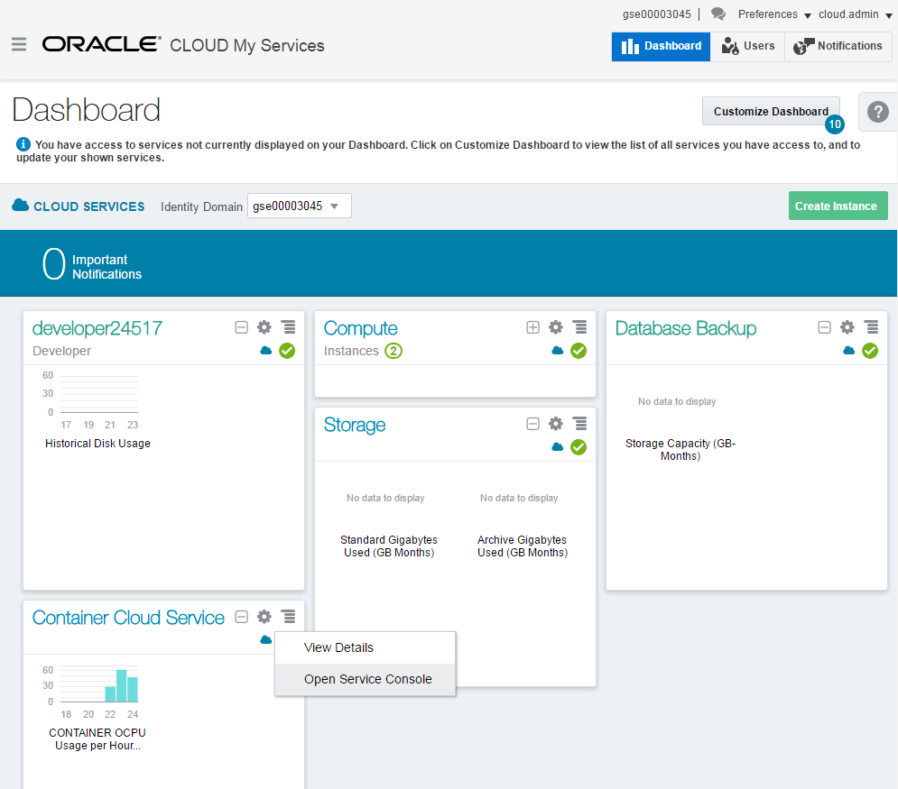

7.  컨테이너 클라우드 서비스 콘솔이 아래에 표시됩니다.

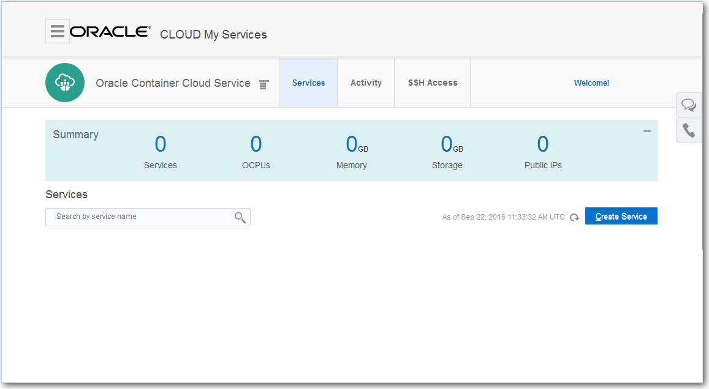

>   Services tab

Create a New OCCS Service Instance
----------------------------------

1.  Oracle Container Cloud Service 콘솔의 서비스 탭에서, **Create Service**
    클릭하여 Oracle Container Cloud Service 인스턴스 작성 마법사를 표시 하십시오

    다음과 같이 새 서비스 인스턴스의 이름과 설명을 지정하십시오.

    **Service Name:** tutorial-instance

    **Service Description:** Tutorial instance

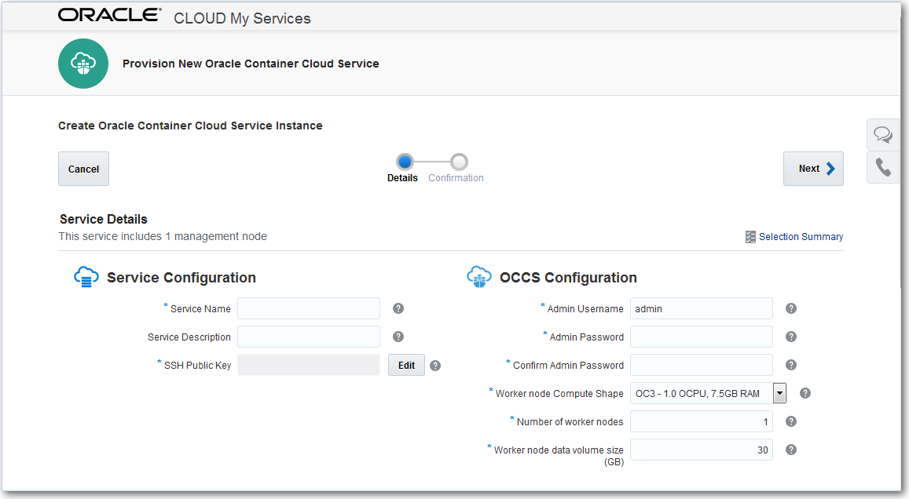

2.  **SSH Public Key** 필드 옆에 **Edit** 버튼을 클릭하십시오.

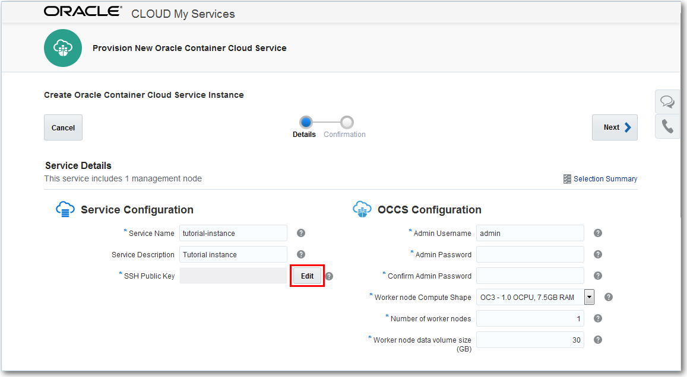

3.  VM 공용 키 입력 대화 상자에서 새 키 작성 옵션을 선택하고 Enter를 클릭
    하십시오

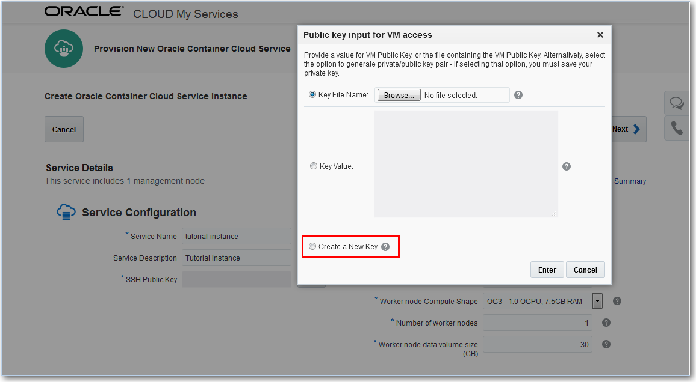

4.  Download Keys 대화 상자에서, Download 를 클릭 하십시오.

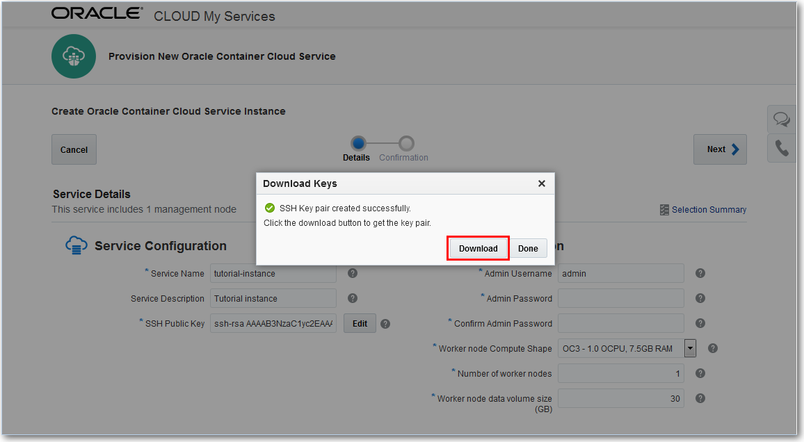

5.  sshkeybundle.zip 파일을 저장할 임시 위치를 지정하십시오.

Tip: 이 튜토리얼에서는 sshkeybundle.zip 파일을 사용하지 않을 것이지만, 좋은 임시
보관을 위해 나중에 삭제할 것이므로, 지정한 임시 위치를 적어 두십시오

6.  Download Keys 대화 상자에서 **Done** 을 클릭하십시오

7.  Service Instance Creation Wizard로 돌아가서, 다음과 같이 인스턴스 관리자
    자격 증명을 입력하십시오 :

**Admin Username**: admin (기본값)

**Admin Password**: 선택한 암호를 지정 하십시오

**Tip**: 필요하다면 패스워드를 적어둔다.

8.  이 튜토리얼의 목적에 따라 Worker 노드 설정의 기본값은 문제가 없으므로
    변경하지 마십시오.

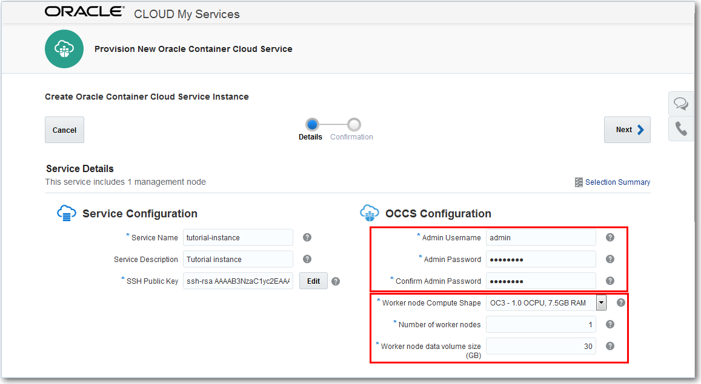

9.  **Next** 를 클릭하고 확인 페이지에 입력 한 세부 정보를 확인하십시오.

10.  **Create** 를 클릭하여 Oracle Container Cloud Service 인스턴스를 만듭니다.

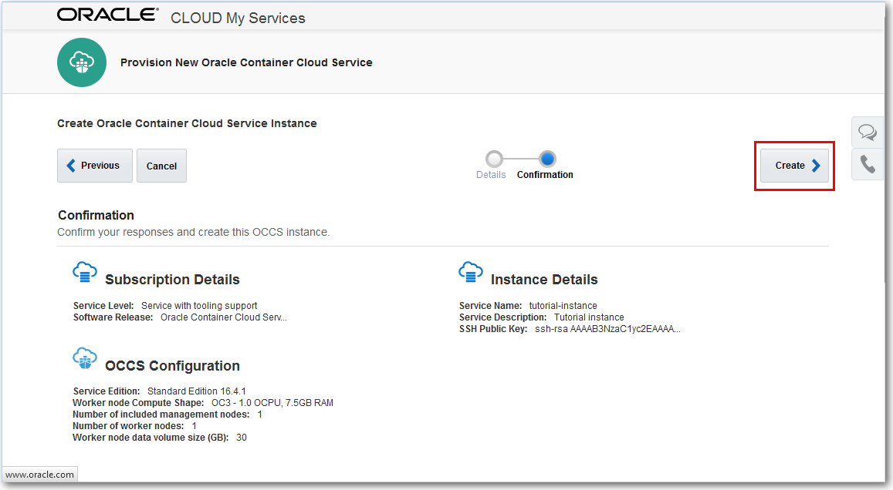

11.  Oracle Container Cloud Service 콘솔의 의 서비스 탭이 표시되고, 상태 필드에
    새로운 tutorial-instance 인스턴스와 “Creating service ...” 메시지가
    표시됩니다.

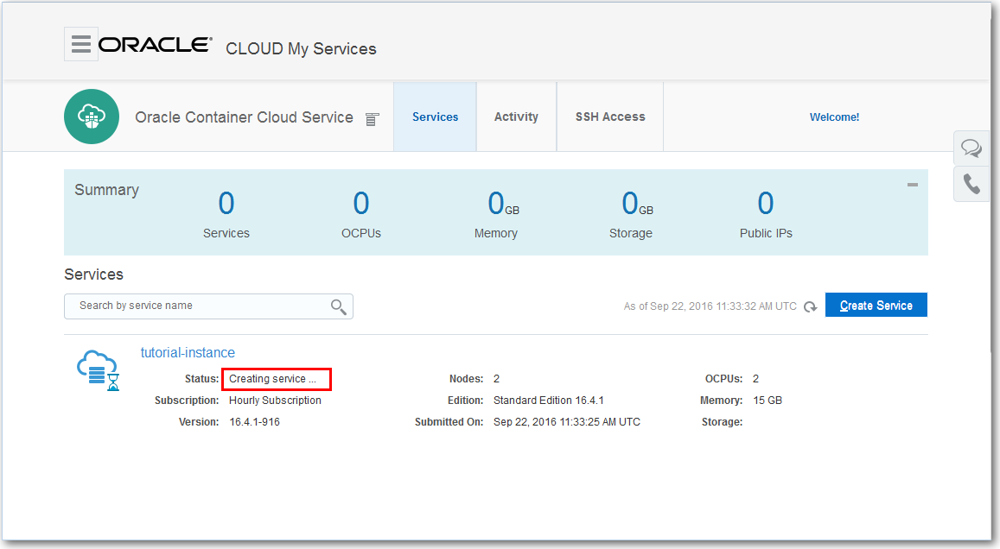

**Tip**: “Creating service ...” 를 클릭하면 인스턴스 생성이 진행되는 동안의 진행
상태와 메시지를 볼 수 있다 . 때때로, 버튼 옆에 Refresh 아이콘을 클릭하여
인스턴스가 제대로 생성되는지를 체크 할 수 있습니다.

12.  몇 분후에, 새 tutorial-instance 인스턴스가 지정한 세부 정보로 작성되고 상태
    필드에 “Creating service ...” 이라는 메시지가 사라집니다.

13.  **tutorial-instance** 를 클릭하면 Service Details 페이지의 인스턴스에 대한
    추가 정보를 볼 수 있습니다.

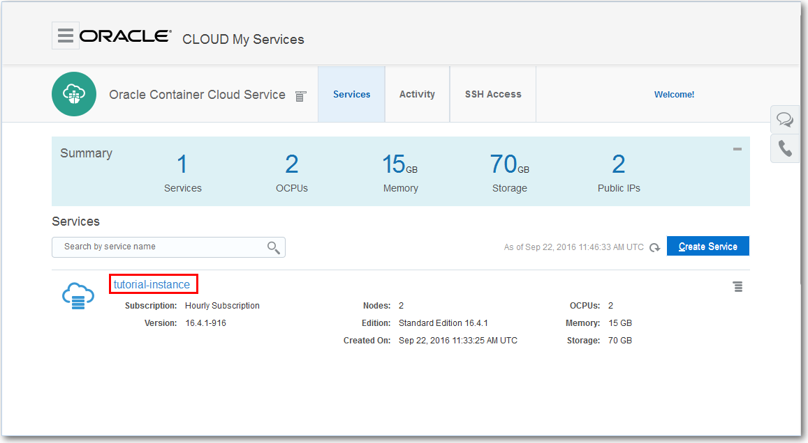

두 개의 가상 머신 (VM)이 생성되었음을 알 수 있습니다 :

하나의 VM은 Oracle Container Cloud Service를 실행하는 Admin 노드입니다.

하나의 VM은 Docker 컨테이너가 배포 될 Worker노드입니다.

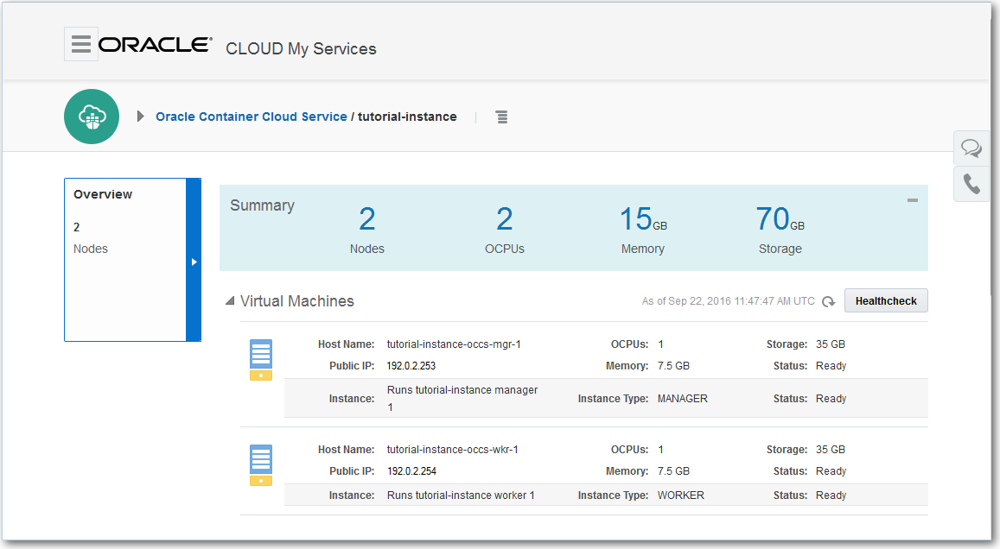

Display the Container Console to Verify the Service Instance is Running
-----------------------------------------------------------------------

이제 서비스 인스턴스를 만들었습니다. 관리자 노드에서 컨테이너 콘솔을 시작하여
서비스 인스턴스가 시작 및 실행 중인지 확인할 수 있습니다.

1.  화면 상단의 tutorial-instance 이름 옆에 있는 메뉴 아이콘을 클릭하고 컨테이너
    콘솔을 선택하십시오..

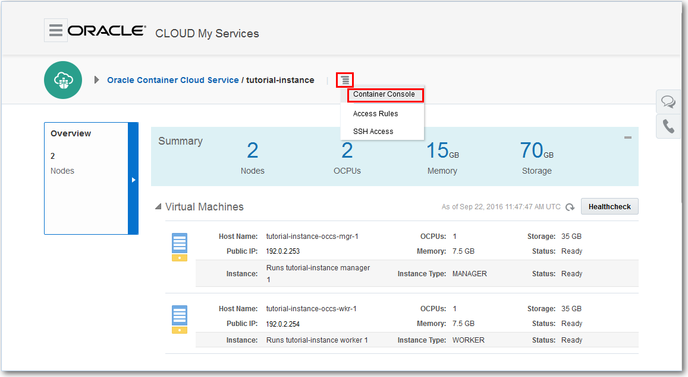

2.  컨테이너 콘솔 로그인 창을 표시하려면 **Container Console** 을 선택하십시오

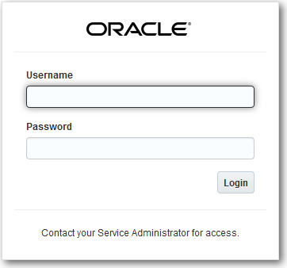

3.  다음credentials을 입력하고 Login 클릭:

**Username**: admin

**Password**: [프로비저닝시 지정한 비밀번호]

컨테이너 콘솔의 대시 보드 페이지가 표시됩니다.

사용 가능한 호스트 (Worker 노드)와 작성된 표준 자원 풀 (default, Development,
Production)을 볼 수 있습니다. Docker 환경을 관리하고 모니터 할 곳입니다.

축하합니다! 새로운 Oracle Container Cloud Service 인스턴스를 성공적으로 생성하고
실행 중인지 확인했습니다.